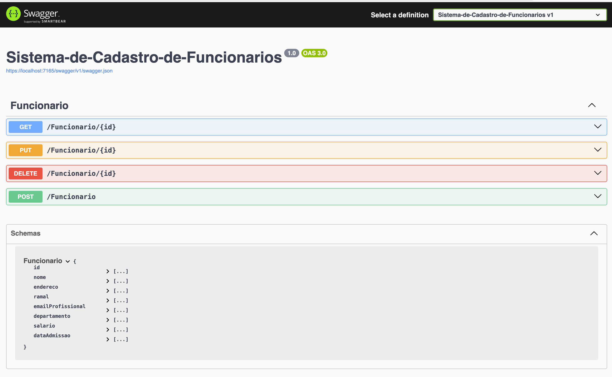
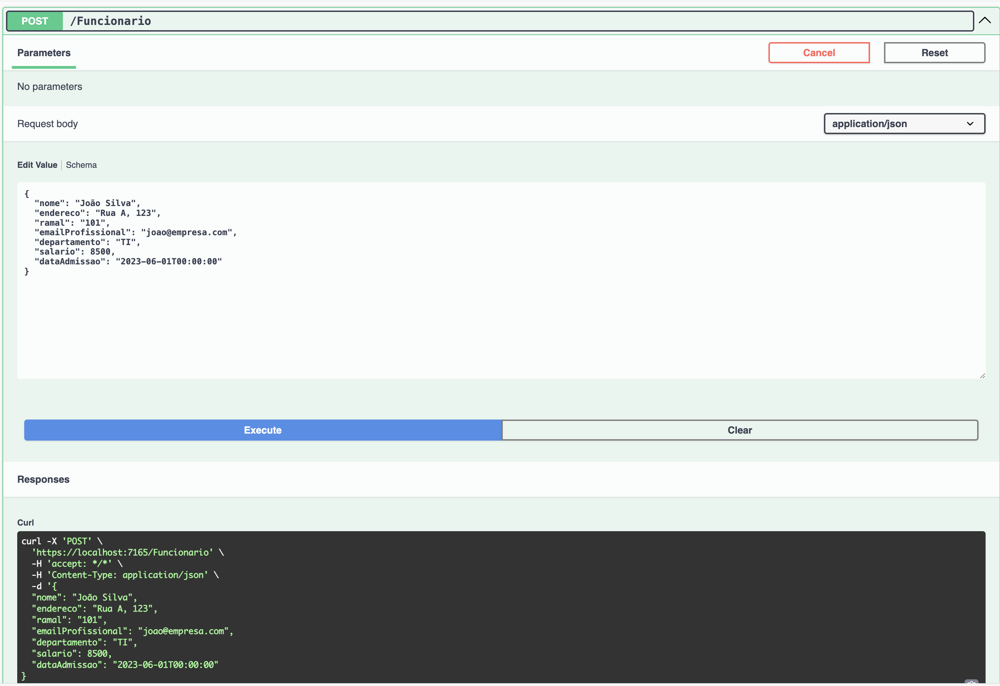

# Sistema de Cadastro de Funcionários

Este projeto consiste em uma API RESTful desenvolvida em .NET com o objetivo de gerenciar o cadastro de funcionários de uma empresa. A aplicação permite realizar operações de criação, leitura, atualização e exclusão (CRUD) de registros, com persistência no Azure Table Storage. O sistema é ideal para fins de estudo e demonstração de integração entre aplicações .NET e serviços em nuvem da Azure.

## Funcionalidades

A API expõe os seguintes endpoints:

- `GET /Funcionario/{id}`: Retorna os dados de um funcionário a partir do ID.
- `POST /Funcionario`: Cadastra um novo funcionário.
- `PUT /Funcionario/{id}`: Atualiza os dados de um funcionário existente.
- `DELETE /Funcionario/{id}`: Remove o registro de um funcionário.

Cada funcionário possui os seguintes atributos:

- `id`
- `nome`
- `endereco`
- `ramal`
- `emailProfissional`
- `departamento`
- `salario`
- `dataAdmissao`

## Etapas de Construção

Durante o desenvolvimento deste projeto, foram seguidas as seguintes etapas:

1. **Criação do Projeto ASP.NET Web API**
   - Estruturação inicial com templates base da Microsoft.

2. **Modelagem da Entidade**
   - Definição da classe `Funcionario` com os campos necessários para o cadastro.

3. **Criação dos Endpoints**
   - Implementação dos métodos HTTP com rotas REST para manipulação de dados.

4. **Integração com Azure Table Storage**
   - Configuração de acesso ao serviço de armazenamento da Azure.
   - Implementação de repositório para persistência e consulta de dados.

5. **Configuração do Swagger**
   - Documentação e testes interativos dos endpoints via interface do Swagger.

6. **Boas Práticas**
   - Remoção de arquivos sensíveis do controle de versão.
   - Adição de `.gitignore` para evitar o versionamento de dados confidenciais.

## Documentação Interativa

A API conta com interface Swagger, onde os endpoints podem ser testados diretamente.

### Visualização Geral da API:

### Exemplo de Requisição POST:

### Exemplo de Resposta 201:

## Requisitos

- [.NET 9.0](https://dotnet.microsoft.com/)
- Conta na [Azure](https://portal.azure.com/) com acesso ao Table Storage
- Ferramenta para testes de API como Swagger (já incluída) ou Postman

